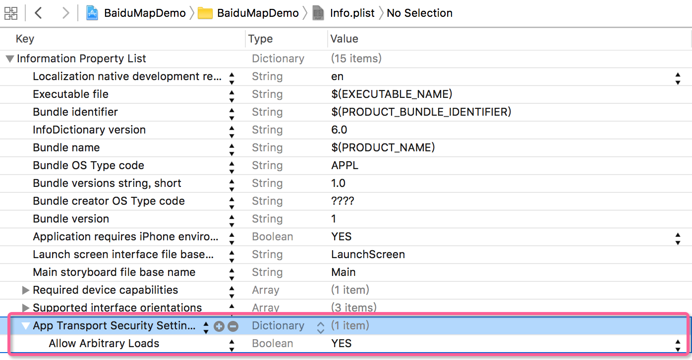
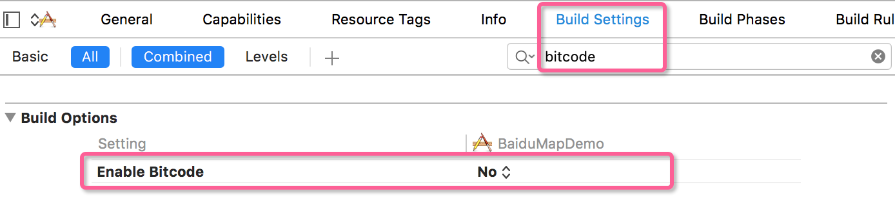
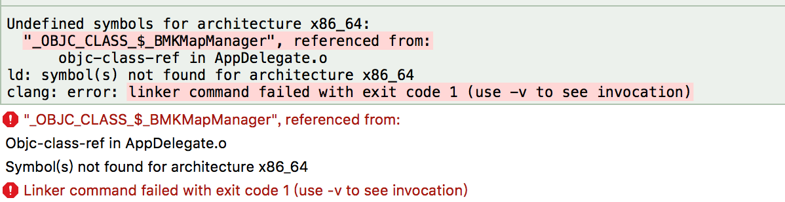
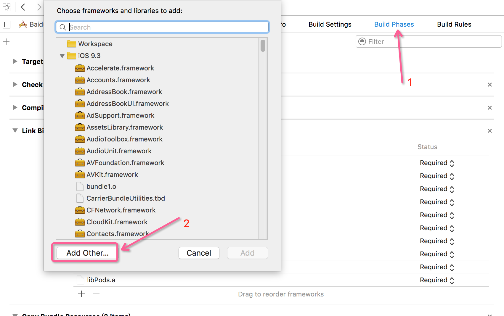
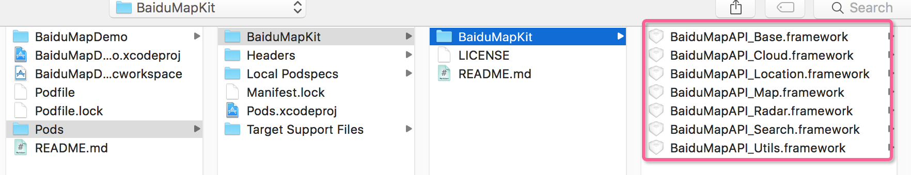
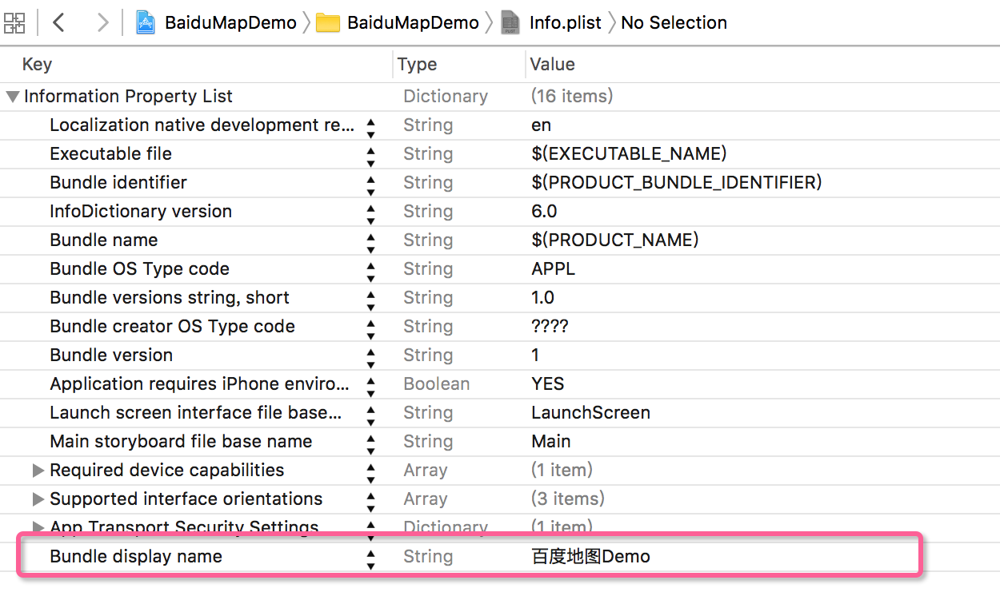
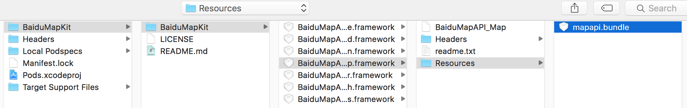
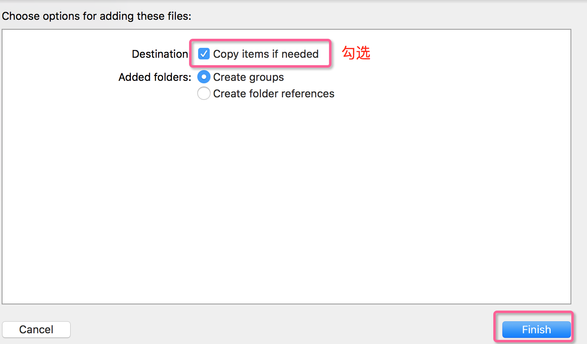
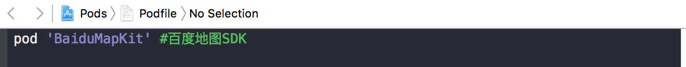
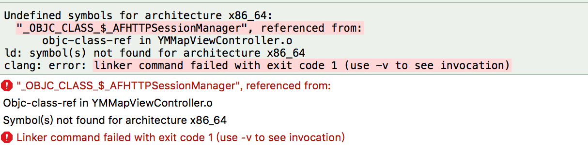

# 百度地图 Demo

## 一、环境设置

1.开发环境：Xocode 7.3.1

2.模拟器环境：iOS 9.3

3.iOS 9 之后不能直接使用 HTTP 进行请求，需要在 Info.plist 新增一段用于控制 ATS 的配置：

```
<key>NSAppTransportSecurity</key>
<dict>
    <key>NSAllowsArbitraryLoads</key>
    <true/>
</dict>
```
也即：



配置完后就可以使用 HTTP 了。

> 注：
> bitcode 是 xcode 7 之后新增的配置选项，默认为 `YES`，我们提交程序到 App store 上时，Xcode 会将程序编译为一个中间表现形式(bitcode)。然后 App store 会再将这个 bitcode 编译为可执行的 64 位或 32 位程序。

在这个 Demo 里不需要使用 bitcode 功能，所以设置为了 `NO`。



4.[导入百度地图 SDK](http://lbsyun.baidu.com/index.php?title=iossdk/guide/buildproject)

百度地图提供了两种导入方式，可以直接把 SDK 拖入到工程，也可以使用 CocoaPods ，这里我是用后面一种方式导入百度地图 SDK。

编辑 Podfile 内容如下：

```
pod 'BaiduMapKit' #百度地图SDK
```

在 Podfile 所在的文件夹下输入命令：

```
pod install
```

但是无论是执行 `pod install` 还是 `pod update` 都卡在了 Analyzing dependencies 不动.

如果之前安装过 CocoaPods，在安装和更新第三方类库的时候建议使用下面的语句，这样不用等太多时间：

```
pod install --verbose --no-repo-update
pod update --verbose --no-repo-update
pod install --no-repo-update
```

#### **手动配置.framework形式开发包**

**第一步、根据需要导入 .framework包**
> 百度地图 iOS SDK 采用分包的形式提供 .framework包，请广大开发者使用时确保各分包的版本保持一致。其中BaiduMapAPI_Base.framework 为基础包，使用 SDK 任何功能都需导入，其他分包可按需导入。
将所需的 BaiduMapAPI_XX.framework 拷贝到工程所在文件夹下。
在 TARGETS->Build Phases-> Link Binary With Libaries 中点击“+”按钮，在弹出的窗口中点击 “Add Other” 按钮，选择 BaiduMapAPI_XX.framework 添加到工程中。
注: 静态库中采用 Objective-C++ 实现，因此需要您保证您工程中至少有一个 `.mm` 后缀的源文件(您可以将任意一个 `.m` 后缀的文件改名为`.mm`)，或者在工程属性中指定编译方式，即在Xcode的Project -> Edit Active Target -> Build Setting 中找到 Compile Sources As，并将其设置为 "Objective-C++"

**第二步、引入所需的系统库**
> 百度地图SDK中提供了定位功能和动画效果，v2.0.0版本开始使用OpenGL渲染，因此您需要在您的 Xcode 工程中引入CoreLocation.framework和QuartzCore.framework、OpenGLES.framework、SystemConfiguration.framework、CoreGraphics.framework、Security.framework、libsqlite3.0.tbd（xcode7以前为 libsqlite3.0.dylib）、CoreTelephony.framework 、libstdc++.6.0.9.tbd（xcode7以前为libstdc++.6.0.9.dylib）。
（注：红色标识的系统库为v2.9.0新增的系统库，使用v2.9.0及以上版本的地图SDK，务必增加导入这3个系统库。）
添加方式：在Xcode的Project -> Active Target ->Build Phases ->Link Binary With Libraries，添加这几个系统库即可。

**第三步、环境配置**
> 在TARGETS->Build Settings->Other Linker Flags 中添加-ObjC。

**第四步、引入mapapi.bundle资源文件**
> 如果使用了基础地图功能，需要添加该资源，否则地图不能正常显示 mapapi.bundle 中存储了定位、默认大头针标注View及路线关键点的资源图片，还存储了矢量地图绘制必需的资源文件。如果您不需要使用内置的图片显示功能，则可以删除 bundle 文件中的 image 文件夹。您也可以根据具体需求任意替换或删除该 bundle 中 image 文件夹的图片文件。
方法：选中工程名，在右键菜单中选择 Add Files to “工程名”…，从BaiduMapAPI_Map.framework||Resources 文件中选择 mapapi.bundle 文件，并勾选 “Copy items if needed” 复选框，单击 “Add” 按钮，将资源文件添加到工程中。

使用 cocoaPods 导入的百度地图，运行之后可能会报错：



这时需要进入



将所有的百度地图 framework 导入到工程中：



然后再运行，错误解决，会出现下面的错误：


这时进入 info.plist 添加 Bundle display name，如下图：



配置百度地图资源文件：




再次运行，控制台会输出『设置成功』则说明设置成功了。



## 二、代码

### 代码结构：

- Classess
	- Controller
		- **YMTableViewController** - 刚进入程序的控制器
		- **YMMapViewController** - 百度地图控制器
		- **YMPoiDetailViewController** - 店铺详情控制器
		- **YMRouteAnnotationController** - 路径规划控制器
	- Model
		- **YMPoi** - 店铺模型
		- **YMPointAnnotation** - 标注模型 
	- View
		- **YMAnnotationView** - 标注视图
		- **YMPaopaoView** - 点击标注弹出自定义的泡泡
	- Category
		- **UIImage+Rotate** - 路径规划界面 image 的扩展

> 注意：
> 1. 需要把 AppDelegate.m 改成 AppDelegate.mm 文件
> 2. 需要把路径规划控制也写成 .mm 后缀，即YMRouteAnnotationController.mm。

1.在 AppDelegate.mm 的 `- (BOOL)application:(UIApplication *)application didFinishLaunchingWithOptions:(NSDictionary *)launchOptions` 中设置百度地图管理者，需要在百度地图 API 控制台设置 AppKey：

```
NSString *mapKey = @"x5EHcRvWZm8uzkt3HUpGBQU3";
    _mapManager = [[BMKMapManager alloc]init];
    // 如果要关注网络及授权验证事件，请设定generalDelegate参数
    BOOL ret = [_mapManager start:mapKey generalDelegate:nil];
    if (ret) {
        NSLog(@"设置成功！");
    }
```

2.使用 cocoaPods 可能会遇到下面的问题



解决办法如下：


再次运行就不会报错了。

3.说明：地图上的标注抓取的是美团的数据。

> **说明：**
> **这只是一个简单的 demo，写的比较粗糙，大家可以给我留言，需要完成什么样的功能，如果有时间，我会尽力加上需要的功能，后面我还会继续更新。谢谢大家的支持！如果你觉得我写的 demo 对你有所帮助，请在 github 上下载的时候顺手给个 star，不胜感激！**

### **下面是 demo 下载地址：**

### [github 下载地址](https://github.com/hrscy/BaiduMapDemo)


